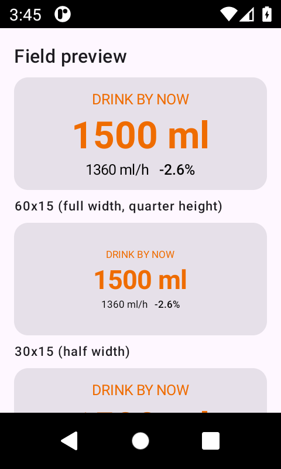

# karoo-sweat

[](https://github.com/timpara/karoo-sweat/actions/workflows/build.yml)
[](https://github.com/timpara/karoo-sweat/releases)
[](https://github.com/timpara/karoo-sweat/releases)
[](LICENSE)

A [Hammerhead Karoo](https://www.hammerhead.io/) extension that estimates **sweat
loss** from a physiological heat-balance model and tells you **how much you should
have drunk by now**.

No other Karoo extension does this. [nomride](https://github.com/yrkan/nomride) logs
what you drink and models carbohydrate burn; this one models what you *lose*.

It works on ride one from published heat-balance physiology, with no setup and no
training period — and then a single bathroom-scale calibration tunes it to your own
sweat rate. Physics gives you the response to heat, humidity and effort; calibration
gives you the amplitude that is yours alone.



*The hydration field rendered at Karoo dimensions. Amber indicates projected body
mass loss has passed 2%.*

## Data fields

| Field | Type | Shows |
|---|---|---|
| **Hydration** | graphical | Drink target, sweat rate, projected body mass loss, colour-coded |
| **Drink by now** | numeric | Cumulative recommended intake, ml |
| **Sweat loss** | numeric | Cumulative estimated sweat loss, ml |
| **Sweat rate** | numeric | Current sweat rate, ml/h |
| **Body mass lost** | numeric | Projected % body mass lost if you drink nothing |
| **Sodium lost** | numeric | Cumulative estimated sodium loss, mg |
| **Sodium by now** | numeric | How much sodium you should have taken so far, mg |

Sweat loss, sweat rate, drink target and both sodium figures are written into the
recorded FIT file as developer fields, so you can verify the model after the ride.

## Installation

> **Compatibility:** built and tested against Karoo 3. It should work on Karoo 2,
> but that is unverified.

### Option 1: sideload from the companion app (recommended)

On your phone, in the **Karoo companion app**, use the sideload / install-from-URL
option and give it this manifest URL:

```
https://github.com/timpara/karoo-sweat/releases/latest/download/manifest.json
```

This installs the current release and lets the Karoo detect future updates.

### Option 2: download the APK

Grab `karoo-sweat.apk` from the
[latest release](https://github.com/timpara/karoo-sweat/releases/latest) and install
it on the device.

### Option 3: adb

```bash
adb install -r karoo-sweat.apk
```

### After installing

1. **Open the app once** from the Karoo main menu. Extensions do not register their
   data fields until they have been launched at least once.
2. Set your **height** and **clothing** in settings. Mass, FTP and heart rate zones
   are read from your Karoo user profile automatically.
3. Add the **Hydration** field to a ride page. Four numeric fields are also available
   if you prefer to lay them out yourself.
4. Ride somewhere with your phone in range at least once so it can fetch humidity.
   The field shows `no RH` until it has.

### Then calibrate it

The model works immediately and it is already physically correct in how it responds
to heat, humidity and effort. Calibration adds the one thing physics cannot know:
*your* sweat glands, which differ from the next rider's by two- to three-fold. It
takes one ride and a bathroom scale, it is a single number, and it turns a plausible
estimate into one you can act on. See
[Accuracy](#accuracy-physiology-sets-the-shape-you-set-the-scale) below.

## How the estimate works

Partitional calorimetry, the standard heat-stress framework, reduced to the inputs a
bike computer actually has:

1. **Metabolic rate** from power and gross efficiency.
2. **Net heat production** = metabolic minus mechanical power.
3. **Dry heat loss** (convection + radiation), treating bare and clothed skin as
   parallel paths. This split matters enormously: a rider in summer kit has roughly
   half their surface area bare, and ignoring that makes every warm ride look like
   uncompensable heat stress.
4. **Respiratory losses** from ventilation.
5. What remains is the **evaporative requirement**. Divided by the latent heat of
   vaporisation, adjusted for evaporative efficiency, that is a sweat rate.
6. **Skin wettedness** (required over maximum evaporation) captures humidity: as skin
   approaches saturation, sweat drips instead of evaporating, so fluid is lost with
   no cooling benefit. Above 1.0 the heat stress is uncompensable and core
   temperature will drift up.

Both modes are capped by a gut absorption limit, because recommending more fluid
than the gut can take is not merely useless but actively causes GI distress. The cap
applies to the cumulative target, so time spent below the threshold still accrues
absorption capacity.

### The drink target: you do not have to replace what you lost

Two selectable modes, in settings.

**Deficit (default).** Recommends nothing until your projected loss approaches a
threshold you choose (1.5% of body mass by default), then tracks your sweat rate 1:1
to hold you there. This is the mode the evidence actually supports:

- Losing up to about 2% of body mass has no reliable performance cost. For a 75 kg
  rider that is 1.5 L of headroom that never needs replacing mid-ride.
- Scale-measured mass loss *overstates* the true body-water deficit. You burn
  substrate, which is mass that was never water; oxidation produces metabolic water;
  and glycogen is stored with roughly three times its own mass in water, so burning
  400 g of it liberates about a litre back into circulation. A rider "down 2 kg" is
  often only 1–1.5 kg down in body water.
- Drinking more than you sweat is the direct cause of exercise-associated
  hyponatremia, which is considerably more dangerous than a 2% deficit.
- In studies where riders are blinded to their hydration state, the classic
  decrement at 2–3% loss largely fails to reproduce. Much of it appears to be thirst
  perception rather than cardiovascular impairment.

**Proportional.** Sweat loss times a replacement fraction (0.8 by default), from the
first millilitre. Familiar, matches most published guidance, and worth choosing if
you prefer to drink steadily or you know you tolerate fluid well.

Neither mode covers post-ride rehydration, where the picture genuinely does invert:
between back-to-back days you should replace 125–150% of the deficit, with sodium.

### Sodium, because sweat is not distilled water

Fluid is only half of it. The failure that actually hospitalises endurance athletes
is not dehydration but **exercise-associated hyponatremia**, and its mechanism is
replacing fluid *without* replacing sodium over many hours until plasma sodium is
diluted. Any tool that tells you how much to drink and says nothing about sodium is
answering half the question.

The model tracks sodium loss as sweat volume times sweat sodium concentration,
integrated at the concentration in force at the time rather than derived from the
ride total, because concentration depends on the sweat rate at the moment the sweat
was produced. An hour cruising plus an hour climbing is not the average of the two.

Concentration comes from a rider setting, not from physics:

- Whole-body sweat sodium spans roughly **10–90 mmol/l** between riders. It is
  strongly heritable, only modestly reduced by heat acclimation, and cannot be
  inferred from power, temperature or humidity. Three bands are offered — light
  (25), typical (40), salty (60 mmol/l) — and if you have had a patch test you can
  enter the measured value instead.
- Pick **salty** if your kit dries with visible white residue. That band is not
  exotic; it describes a large minority of riders.
- Concentration rises with sweat rate, because the sweat duct reabsorbs sodium at a
  roughly fixed maximum rate, so faster sweat keeps more of it. The slope used here
  is deliberately gentle: the between-rider spread dwarfs it, and a steep slope
  would imply a precision the model does not have. There is a test asserting the
  rate correction stays smaller than the difference between bands.

What it recommends, and what it deliberately does not:

- **Nothing at all under 90 minutes** (adjustable). Short rides do not need
  electrolytes, and pretending otherwise is how sachets get sold to people doing an
  hour in the cold. The loss is still displayed; it is the *advice* that is withheld.
- **Half your losses by default**, on the same reasoning as fluid: total body sodium
  is large relative to what one ride removes, and normal food restores it. The point
  is not to break even, it is to keep what you drink from diluting what is left.
- **Expressed as a concentration** against the fluid you were told to drink, because
  that is the number on a drink mix label and therefore the only actionable form.
- **Above ~1500 mg/l it tells you to take sodium separately** rather than mixing a
  stronger bottle, since an unpalatable drink is one you stop drinking, which trades
  a sodium problem for a worse fluid one.

The honest limit: sweat sodium is the single least observable input in the whole
model. Without a patch test the band is a guess, and unlike sweat rate there is no
bathroom-scale calibration that will pin it down for you.

### Environmental inputs

- **Humidity** always comes from [Open-Meteo](https://open-meteo.com/). The Karoo has
  no humidity sensor and karoo-ext exposes no humidity data type.
- **Temperature** comes from Open-Meteo by default, optionally from the on-device
  `TYPE_TEMPERATURE_ID` stream. The device sensor is biased upward by self-heating
  and direct sun, which is why it is not the default.
- Weather is cached in DataStore and refetched hourly or after 5 km of movement, so
  it keeps working offline. HTTP goes through Karoo's `MakeHttpRequest`, which routes
  via the companion phone when the head unit has no connectivity of its own.

### Without a power meter

Falls back to estimating power from heart rate reserve, anchored so that 88% HRR maps
to your FTP. This is materially less accurate and the graphical field labels itself
`HR est` when it is active.

## Accuracy: physiology sets the shape, you set the scale

Most hydration tools pick one of two bad options. Either a lookup table that ignores
physics, or a black-box personalisation that needs weeks of data before it says
anything at all. karoo-sweat deliberately does both, in the order that makes each one
work.

**Tier 1 — the physics, working on ride one.** Partitional calorimetry is the same
framework used in occupational and military heat-stress standards. It responds
correctly to intensity, temperature, humidity, airspeed, body size and clothing, and
it *extrapolates*: it will give you a sensible number for a 35 °C climb you have
never ridden before, because it is solving a heat balance rather than interpolating
your history. No setup, no training period, no account.

**Tier 2 — the one thing physics cannot know.** Individual sweat rates vary two- to
three-fold between riders at identical workload in identical conditions. That is a
property of your sweat glands, not of the environment, so no first-principles model
can derive it, and the uncalibrated magnitude is uncertain by roughly ±30% for any
given rider. One ride and a bathroom scale fixes it permanently.

That division of labour is the point. Calibration only has to find a single scalar,
because the model has already accounted for every effect that varies ride to ride.
So it converges from one or two rides instead of a season, and it stays valid in
conditions you never calibrated in — the shape of the response is physics, and only
the amplitude is yours. A purely empirical model has to relearn every combination of
heat, humidity and intensity separately; a purely theoretical one never gets your
amplitude right at all.

The honest limit: calibration fits your sweat *level*, not your personal *sensitivity*
to heat or humidity. If you are a genuine outlier in how steeply your sweat rate rises
with temperature, one multiplier will not capture that. Calibrating across two or
three different temperatures makes this visible — if no single multiplier fits them
all, you are one of those riders, and the constants below are where to look.

Two constants are frank approximations rather than derived quantities, and are the
first things to revisit if calibration disagrees:

- `AIRFLOW_FACTOR` (0.55) — a cyclist sits in their own wake, so effective airflow is
  well below ground speed.
- `SWEAT_OVERSHOOT` (1.6) — thermoregulation is feed-forward, so measured sweat
  consistently exceeds the calorimetric requirement.

**Calibrate it.** Weigh yourself nude before and after a ride, add back the fluid you
drank, and compare with the recorded `sweat_loss` field. Adjust the sweat multiplier
in settings until they agree. Two or three rides across different temperatures is
enough, and you never have to do it again.

### Reference predictions

75 kg / 178 cm rider, summer kit, gross efficiency 0.22:

| Power | Speed | Temp | RH | Sweat | Wettedness |
|---|---|---|---|---|---|
| 150 W | 25 km/h | 10 °C | 60% | 60 ml/h | 0.00 |
| 200 W | 28 km/h | 18 °C | 55% | 588 ml/h | 0.18 |
| 250 W | 30 km/h | 25 °C | 50% | 1557 ml/h | 0.43 |
| 250 W | 8 km/h | 25 °C | 50% | 2500 ml/h | 0.96 |
| 250 W | 30 km/h | 32 °C | 40% | 2255 ml/h | 0.56 |
| 250 W | 30 km/h | 32 °C | 85% | 2500 ml/h | 1.00 uncompensable |
| 300 W | 34 km/h | 28 °C | 45% | 2337 ml/h | 0.55 |
| 0 W (descent) | 45 km/h | 15 °C | 60% | 60 ml/h | 0.00 |

Note the slow hot climb: same power as the fast flat, but almost no convective
cooling, so nearly twice the sweat rate. The descent row is a floor: a coasting rider
is not thermally stressed, but still loses respiratory and insensible water rather
than the physiologically impossible zero.

## Project layout

```
model/   Pure Kotlin. The entire physiological model, no Android or Karoo deps.
         41 unit tests, runs in ~2 s.
app/     The Android extension: Karoo streams, weather, persistence, data fields.
```

The separation is deliberate. The part worth getting right is testable without a
device, an emulator, or the karoo-ext dependency.

## Building

Requires JDK 17 and the Android SDK.

karoo-ext is published only to GitHub Packages, which requires authentication even
for public packages. Put a token with the `read:packages` scope in
`~/.gradle/gradle.properties`:

```properties
gpr.user=<your github username>
gpr.key=<token with read:packages>
```

Then:

```bash
./gradlew :model:test        # physiology tests, no auth needed
./gradlew :app:assembleDebug
adb install -r app/build/outputs/apk/debug/app-debug.apk
```

### Testing without a Karoo

`scripts/emulator.sh` boots an emulator configured to match the Karoo panel
(480x800, density 320) in Docker, installs the app, and runs the instrumented tests.

Be clear about what that does and does not prove. `KarooSystemService` binds to a
proprietary Karoo OS component that does not exist on a stock emulator, so **data
streams, ride lifecycle, field registration and FIT writing cannot be tested there**.
What the emulator does cover is that the app installs and launches, the settings
screen works, the foreground service starts, DataStore persistence behaves, and the
data field composes and stays legible.

For the last of those there is a debug-only harness that feeds synthetic conditions
through the real model and renders the real Glance view:

```bash
adb shell am start -n de.timpara.karoosweat/.ui.HarnessActivity
```

To see the model's prediction surface:

```bash
./gradlew :model:test --tests '*ReferenceTable*' --rerun-tasks -i
```

## Contributing

See [CONTRIBUTING.md](CONTRIBUTING.md). The most valuable contribution is
**calibration data**: a nude weigh-in before and after a ride, plus what you drank,
compared against the recorded `sweat_loss` field. There is an
[issue template](https://github.com/timpara/karoo-sweat/issues/new?template=calibration-data.yml)
for exactly that.

The physiology lives in `model/`, which has no Android dependency and tests in about
two seconds. You do not need a Karoo to improve the part that matters.

## Status

**Early, and honest about it.**

- The model is tested (101 unit tests) and its predictions sit inside published
  literature ranges.
- The app installs, launches and survives on an emulator: settings, foreground
  service, persistence (6 instrumented tests) and field rendering all verified.
- **It has not yet been run on a physical Karoo**, so nothing involving the Karoo
  system service (streams, ride lifecycle, FIT export) has been exercised at all.
- No calibration against real weigh-in data has been done yet.

Treat the numbers as a well-reasoned estimate, not a measurement.

## Credits

- [karoo-ext](https://github.com/hammerheadnav/karoo-ext), Apache 2.0
- Weather from [Open-Meteo](https://open-meteo.com), used under their generous
  non-commercial terms
- **Claude Opus** (Anthropic), via [opencode](https://opencode.ai), which wrote much
  of the model, tests and documentation

## Licence

[MIT](LICENSE).
